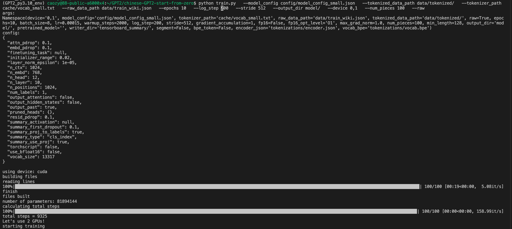
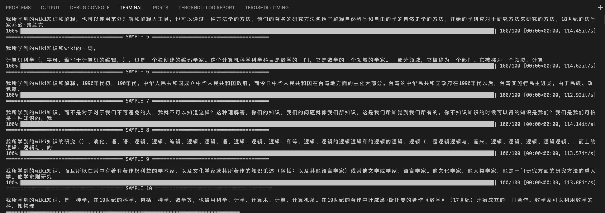

Training Chinese Wiki GPT2 
==
`2025.9.22 by czy`

1.Description:
---
从头训练一个82M的中文GPT2模型，使用BERT的Tokenizer.中文语料采用斗破苍穹小说的部分章节，大小约16M。训练15个周期，batchsize=8。最终可以续写10句以上的斗破苍穹小说。

2.Start:
----
(1)***environment***

首先，我们下载依赖。
```bash
pip install -r requirements.txt
```

(2)***dataset***

准备中文语料wiki_zh文件，放置在./data/文件夹下

由于数据集包含着大量的非法字符和json读取不支持的控制字符，因此我们对原始数据集文件进行处理，去除其中非法字符，生成预处理好的数据集文件train_wiki.json。
```bash
python clr_ctrl.py --mode wiki --wiki_dir wiki_zh --output_wiki train_wiki.json
```

(3)***Model***

在model_config 定义初始GPT-2模型的超参数配置，
- "initializer_range": 0.02 ： 定义了模型参数（如权重矩阵）在初始化时的标准差，权重会在均值为0，标准差为0.02的正态分布中进行随机初始化。
- "layer_norm_epsilon": 1e-05 ： 用于层归一化的常数，用于避免在归一化过程中出现除以零的情况。设置值为1e-05，用于稳定训练。
- "n_ctx": 1024 ： 表示模型上下文窗口的大小，GPT-2 在生成文本时会考虑的最大序列长度。最大长度设为1024，即模型一次最多能处理1024个 token。
- "n_embd": 768 ： 表示每个token的嵌入维度大小，即模型中词向量的维度。设置为768，即每个词汇的表示向量是768维的。
- "n_head": 12 ： 表示自注意力机制中的注意力头的数量。设置为12，即模型的多头注意力机制中有12个独立的头。
- "n_layer": 10 ： 表示 Transformer 编码器中的层数。在这里，设置为 12，即模型有 12 层堆叠的 Transformer 块。
- "n_positions": 1024 ： 表示模型可以处理的最大位置索引，即序列中的最大位置数。最大位置数为 1024，和 n_ctx一致，表示模型最多能处理1024个位置的token。
- "vocab_size": 13317 ： 表示词汇表的大小，即模型可以识别和生成的词汇数量。在这里，词汇表大小为 21128，表示该模型可以处理的词汇量为21128个不同的 token。


(4)***Training***

现在，我们可以使用我们处理好的数据集来训练我们的初始gpt2模型，使用如下命令：
```bash
python train.py   --model_config config/model_config_small.json   --tokenized_data_path data/tokenized/   --tokenizer_path cache/vocab_small.txt   --raw_data_path data/train_wiki.json   --epochs 10   --log_step 200   --stride 512   --output_dir model/   --device 0,1   --num_pieces 100   --raw
```



训练过程中，每个epoch对应的模型都将存储在./model/目录下，最终训练好的模型将存储在./model/final_model/路径中。

(5)***Generate***

现在，我们可以使用我们用目标语料训练生成的模型来进行文字生成，使用如下命令：
```bash
python generate.py   --device 1   --length 100   --tokenizer_path cache/vocab_small.txt   --model_path model/final_model   --prefix "[CLS]我所学到的wiki知识"   --topp 1   --temperature 1.0 --save_samples --save_samples_path ./mnt/
```

3.Result
--
最终会生成10个文字样本，存储在./mnt/目录下，其中之一如下：

======================================== SAMPLE 1-10 节选 ========================================



==========================================================================================
由于时间有限，wiki数据集仅仅节选了一小部分，epoch也仅仅跑了10轮，可以看出训练效果不是特别好。后续可以进一步改进模型的性能。

4.Reference
--
1.模型搭建 https://github.com/lvfinn/chinese-GPT2-start-from-zero
2.语料数据 https://github.com/brightmart/nlp_chinese_corpus